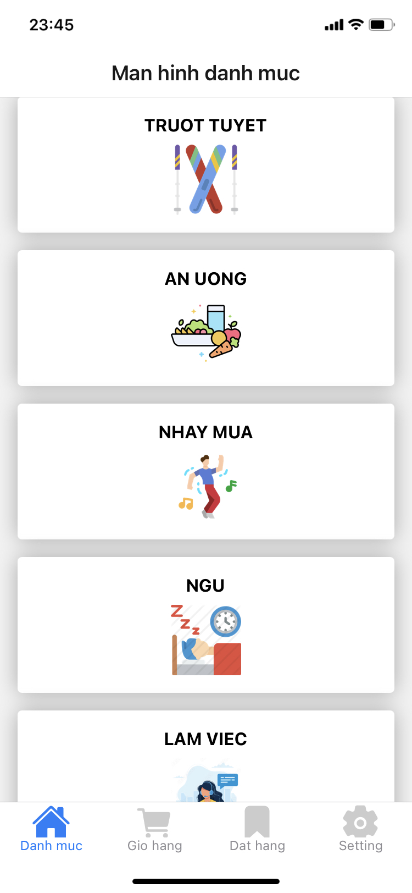
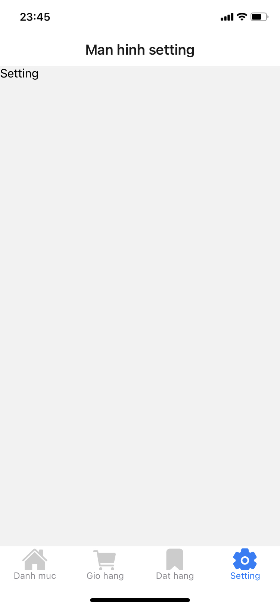
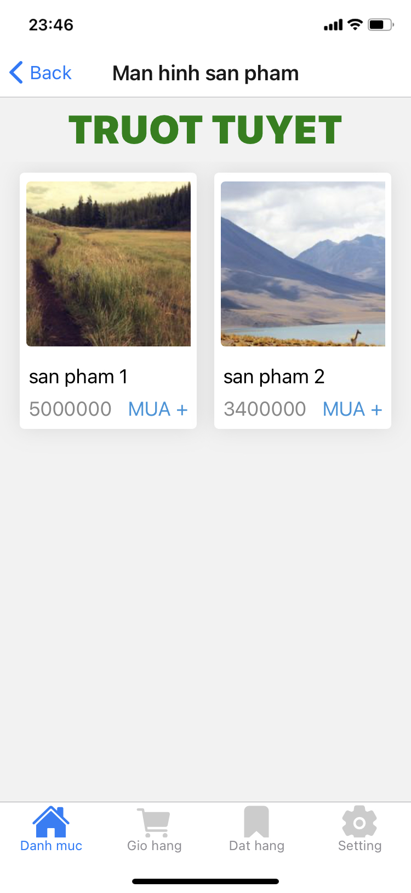
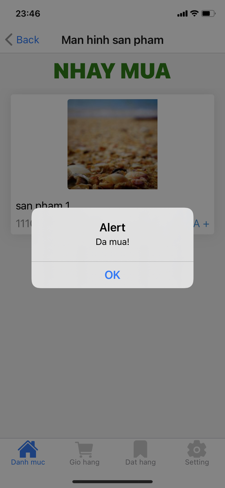
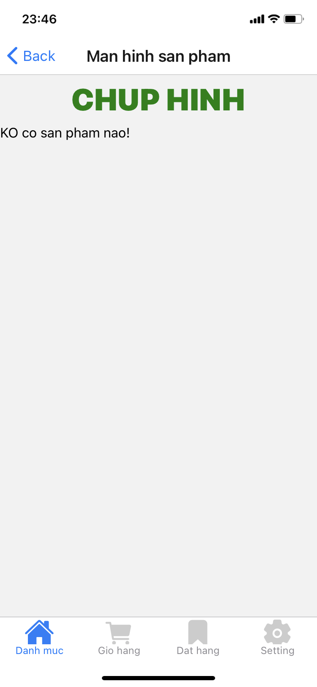

# rn-demo-coders-x 🐳


[](https://github.com/tquangdo/rn-demo-coders-x/issues/new)

## usage
1.
```shell
yarn install > yarn start
```
2.
```shell
yarn run mock-server
->
  Resources
  http://localhost:3000/categories
  http://localhost:3000/products
```
3. scan bar code on `expo go` appstore

## demos






## config ngrok
1. login with github acc: `https://dashboard.ngrok.com/get-started/your-authtoken`
2. authen
```shell
(08/24/21)NC00011462@dotq ~/Downloads# ./ngrok authtoken <your_auth_token>
->
 Authtoken saved to configuration file: /Users/NC00011462/.ngrok2/ngrok.yml
```
3.run
```shell
./ngrok http 3000
```
-> will show http://xxx.ngrok.io -> copy paste into `common/constants.js`

## react-devtools
1. `yarn add react-devtools`
2. package.json
```json
"scripts": {
    "react-devtools": "react-devtools",
    ...
  },
```
3. `yarn run react-devtools` 
